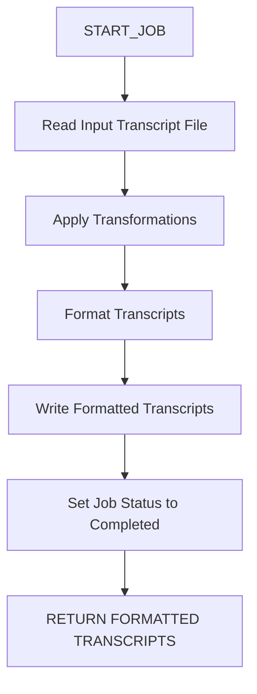
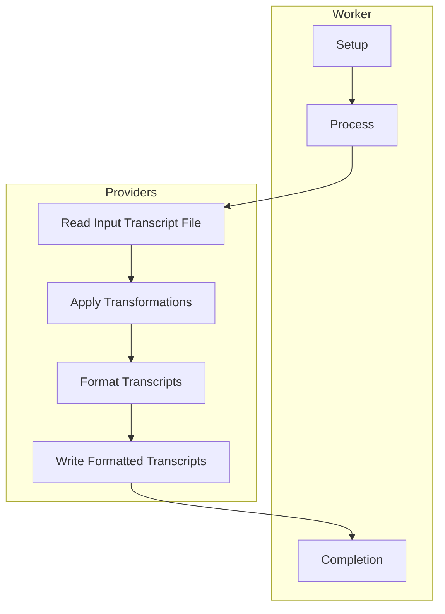

# rs_transcript_worker
 
## Project Overview
 
The `rs_transcript_worker` is a Rust-based worker designed to process transcripts using different providers. This worker is integrated with the Media Cloud AI platform and supports various transcript formats and transformations.
 
## Objectives of the Worker
 
The primary objective of this worker is to process transcripts based on specified parameters and providers. The worker reads input transcript files, applies transformations, and outputs the processed transcripts in the desired format.
 
## Functionnement
 
1. **Setup**: The worker initializes and sets up any necessary configurations.
2. **Process**: The worker processes the job by:
   - Reading the input transcript file from the specified source path.
   - Applying the specified transformations based on the input parameters.
   - Formatting the transcripts according to the specified provider.
   - Writing the formatted transcripts to the specified destination path.
   - Logging the processing steps and setting the job status to completed.
3. **Completion**: The worker returns the formatted transcripts.
 
## Environmental Variables
 
- None specified in the code.
 
## Services Used
 
- None specified in the code.
 
## CPU/GPU
 
This worker primarily requires CPU resources for processing transcript files and applying transformations. There are no specific GPU requirements.
 
## Project Architecture
 
The project follows a modular architecture with the following components:
 
- **Providers Module**: Contains provider-specific implementations, including `speechmatics`.
- **Format Module**: Contains functions for formatting transcripts.
- **Main Module**: Implements the worker logic, including setup and processing functions.
 
## Usage / Deployment Guide
 
### Prerequisites
 
- Rust
- Docker (for containerization)
 
### Installation
 
1. **Clone the Repository**:
   ```sh
   git clone git@gitlab.com:media-cloud-ai/workers/media/rs_transcript_worker.git
   cd rs_transcript_worker
   ```
 
2. **Install Dependencies**:
   ```sh
   cargo build
   ```
 
3. **Build Docker Image**:
   ```sh
   docker build -t rs_transcript_worker .
   ```
 
4. **Run the Worker**:
   ```sh
   docker run rs_transcript_worker
   ```
 
## Created Resources
 
- **BigQuery Datasets**: None
- **Tables**: None
- **Buckets**: None
- **Service Accounts**: None
 
## Produced Data
 
The worker produces formatted transcript files in the specified destination path. The format of the output transcripts depends on the input parameters and the specified provider.
 
## Visual Elements
 
### Flowchart
 

 
### Diagram
 

 
## Authors and Acknowledgment
 
This project is maintained by the France TV DAIA team. Special thanks to all contributors who have helped improve the project.
 
## License
 
This project is licensed under the MIT License. See the [LICENSE](LICENSE) file for more details.
 
## Project Status
 
The project is actively maintained and open to contributions. If you have any questions or need support, please open an issue or contact the maintainers.
 
## Contributing
 
We welcome contributions! Please read the [CONTRIBUTING.md](CONTRIBUTING.md) file for guidelines on how to contribute to this project.
 
## Support
 
For support, please open an issue on the GitLab repository or contact the maintainers directly.
 
## Roadmap
 
Future releases may include:
- Enhanced error handling and logging.
- Support for additional transcript formats.
- Improved documentation and examples.
 
---
 
**Note**: This README.md is based on the provided code and project structure, with secondary inspiration from existing markdown files. Any information derived from potentially outdated sources is clearly indicated.
