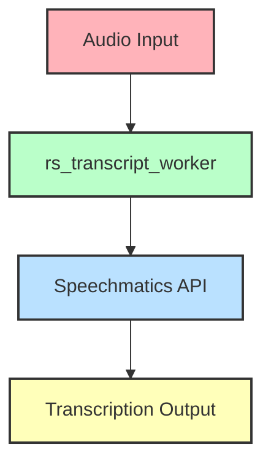

# rs_transcript_worker

## Project Description
The `rs_transcript_worker` is a Rust-based application designed to process transcripts using various providers. It leverages different services to handle speech recognition tasks and provides a structured way to manage and format the transcribed data.

## Project Architecture
The project is structured into several directories and files, each serving a specific purpose:

```
.
|-- examples
|   |-- authot.json
|   `-- speechmatics.json
|-- ressources
|   `-- custom_vocabulary.json
|-- src
|   |-- format
|   |   `-- mod.rs
|   |-- providers
|   |   |-- speechmatics
|   |   |   |-- mod.rs
|   |   |   |-- start_recognition_information.rs
|   |   |   `-- websocket_response.rs
|   |   `-- mod.rs
|   `-- main.rs
|-- Cargo.lock
|-- Cargo.toml
|-- Dockerfile
|-- LICENSE
|-- README.md
|-- build.rs
`-- rustfmt.toml
```

### Key Components
- **examples/**: Contains example configuration files for different providers.
- **ressources/**: Holds resources like custom vocabulary files.
- **src/**: The main source directory containing the code for formatting and provider-specific implementations.
- **Cargo.toml**: The Rust package manager file, specifying dependencies and project metadata.
- **Dockerfile**: Used for containerizing the application.

## Usage / Deployment Guide
To deploy and use the `rs_transcript_worker`, follow these steps:

1. **Build the Project**: Use Cargo to build the project.
   ```bash
   cargo build --release
   ```

2. **Run the Application**: Execute the compiled binary.
   ```bash
   ./target/release/rs_transcript_worker
   ```

3. **Docker Deployment**: Build and run the Docker container.
   ```bash
   docker build -t rs_transcript_worker .
   docker run rs_transcript_worker
   ```

## Objectives of the Worker
The worker is designed to:
- Process audio transcripts using different speech recognition providers.
- Format and manage the transcribed data efficiently.

## Functioning
The operation of the worker involves:
1. Initializing the required configurations and resources.
2. Connecting to the specified speech recognition provider.
3. Sending audio data for transcription.
4. Receiving and processing the transcribed data.
5. Formatting the output as per the specified requirements.

## Environmental Variables
The application may require the following environment variables:
- `PROVIDER_API_KEY`: API key for the speech recognition provider.
- `CUSTOM_VOCABULARY_PATH`: Path to the custom vocabulary file.

## Services Used
The worker interacts with the following services:
- **Speechmatics**: For speech-to-text transcription via WebSocket connections.

## CPU/GPU Requirements
This worker primarily requires a CPU for its operations. There is no specific requirement for a GPU.

## Visual Elements

### Architecture Diagram


## License
This project is licensed under the terms specified in the LICENSE file.

---

This README provides a comprehensive overview of the `rs_transcript_worker` project, detailing its structure, usage, and functionality. For further details, refer to the source code and configuration files included in the project.
